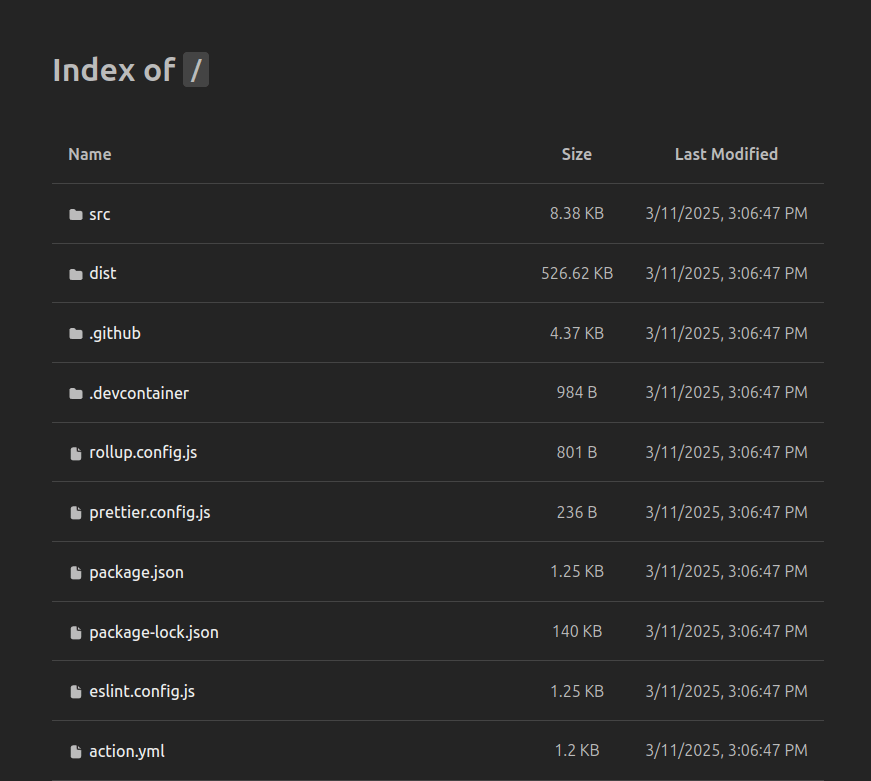

# 📂 Generate `index.html` Files for Directory Listings

![Release Version][badge_release_version]
[![Build Status][badge_build]][link_build]
[![License][badge_license]][link_license]

This GitHub Action generates an `index.html` file for specified directories, allowing easy browsing of static files.
It is particularly useful for repositories using [GitHub Pages](https://pages.github.com/) or other static file
hosting solutions.

It works straightforward - you provide a path to a directory, and it generates an `index.html` file in each
subdirectory it finds within it. Once generated, you can store all the files, including the `index.html` files,
and deploy them to your hosting provider (e.g., GitHub Pages).

The motivation behind this action is to provide a simple way to generate directory listings with a modern look due to
GitHub Pages' lack of support for directory listings. However, in some cases, you may need to host artifacts via
HTTP (e.g., for Helm charts) with opportunities to browse them.

> Inspired by [generate-directory-listing-action](https://github.com/yKicchan/generate-directory-listing-action).

[badge_build]:https://img.shields.io/github/actions/workflow/status/gacts/directory-listing/tests.yml?branch=master&maxAge=30
[badge_release_version]:https://img.shields.io/github/release/gacts/directory-listing.svg?maxAge=30
[badge_license]:https://img.shields.io/github/license/gacts/directory-listing.svg?longCache=true
[link_build]:https://github.com/gacts/directory-listing/actions

## 🎨 Demo

| Light                           | Dark                          |
|---------------------------------|-------------------------------|
|  |  |

> [!NOTE]
> The theme is selected automatically based on the user's system preference (light or dark mode).

The full demo is always [available here](https://gacts.github.io/directory-listing/demo/).

## 🚀 Usage

```yaml
jobs:
  generate-index:
    runs-on: ubuntu-latest
    steps:
      - uses: gacts/directory-listing@v1
        with:
          target: ./assets
          # target: .
          # ignore: |
          #   build/**
          #   **/index.html
          #   node_modules/**,**/*.log
          # show-hidden: true
          # overwrite: true

      - uses: peaceiris/actions-gh-pages@v4
        with:
          github_token: ${{ secrets.GITHUB_TOKEN }}
          publish_dir: ./assets
```

## ⚙️ Customization

### Inputs

These input parameters can be specified using `with`:

| Name          | Type          | Default              | Required | Description                                                                 |
|---------------|---------------|----------------------|----------|-----------------------------------------------------------------------------|
| `target`      | `string`      | `.`                  | No       | The path to the directory where the `index.html` file should be generated   |
| `ignore`      | `string/list` | `**/index.html`      | No       | Comma or newline-separated [patterns][glob] of files/directories to exclude |
| `show-hidden` | `boolean`     | `false`              | No       | Whether to include hidden files and directories in the listing              |
| `overwrite`   | `boolean`     | `false`              | No       | Whether to overwrite an existing `index.html` file in the target directory  |
| `footer`      | `string`      | `<link to the repo>` | No       | The footer content to be added to the index file                            |

[glob]:https://github.com/isaacs/node-glob#usage

### Outputs

| Name        | Type       | Description                                              |
|-------------|------------|----------------------------------------------------------|
| `generated` | `string[]` | An array of paths where `index.html` files were created. |

## 📦 Releasing

To release a new version:

1. Build the action distribution: `make build` or `npm run build`
2. Commit and push all changes, including the `dist/` directory (this is **mandatory**).
3. Publish a new release via the [GitHub Releases](https://github.com/gacts/directory-listing/releases) page.
   Use the format `vX.Y.Z` for the release tag (e.g., `v1.2.3`).
4. The `vX` and `vX.Y` tags (e.g., `v1`, `v1.2`) will be updated automatically.

> [!TIP]
> Use [Dependabot](https://bit.ly/45zwLL1) to keep this action updated in your repository.

## 💬 Support

[![Issues][badge_issues]][link_issues]
[![Pull Requests][badge_pulls]][link_pulls]

Encounter a bug or need a feature? [Create an issue][link_create_issue] in this repository.

[badge_issues]:https://img.shields.io/github/issues/gacts/directory-listing.svg?maxAge=45
[badge_pulls]:https://img.shields.io/github/issues-pr/gacts/directory-listing.svg?maxAge=45
[link_issues]:https://github.com/gacts/directory-listing/issues
[link_create_issue]:https://github.com/gacts/directory-listing/issues/new
[link_pulls]:https://github.com/gacts/directory-listing/pulls

## 📜 License

This project is licensed under the [MIT License][link_license].

[link_license]:https://github.com/gacts/directory-listing/blob/master/LICENSE
